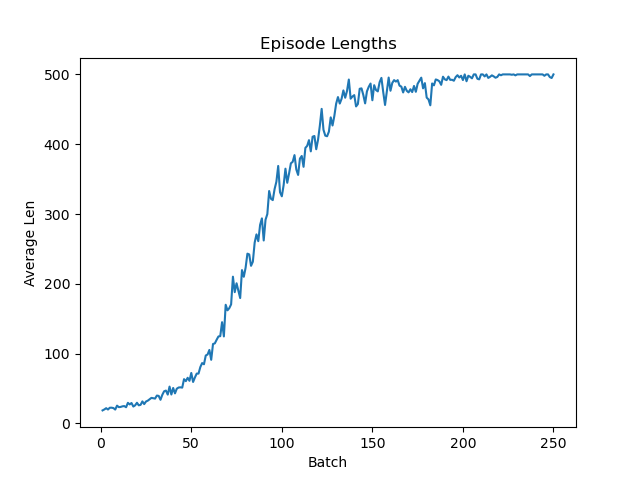

# Policy Gradient Algorithms

Implemented
- reinforce 
- ppo
- rtg and gae for weights

<table>
  <tr>
    <td></td>
    <td></td>
  </tr>
  <tr>
    <td colspan="2" align="center">
      <em>CartPole (PPO + GAE): episodes approach the 500 step cap (max reward)</em>
    </td>
  </tr>
</table>


To test:
```
>>> git clone https://github.com/rohank36/pgas.git
# have env with Gymnasium and PyTorch activated
# choose which policy to test in test.py
>>> python test.py
```